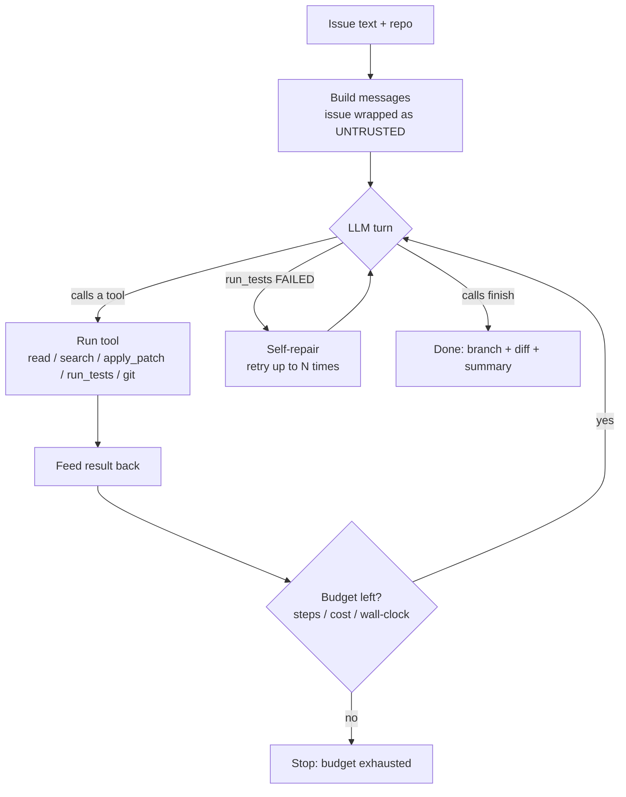
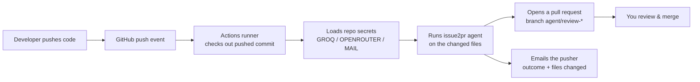

# Issue2PR

Autonomous **GitHub issue -> tested pull request** agent.

Issue2PR reads a GitHub issue, explores a repository in a sandboxed workspace,
edits code, runs the test suite, self-repairs on failure, and produces a diff /
pull request — all driven by an LLM using an OpenAI-compatible tool-calling
loop. The default LLM provider is **Groq** (`openai/gpt-oss-120b`), with
automatic fallback to OpenRouter / Azure OpenAI when keys are present.

---

## How it works

The agent core is a tool-calling loop: the LLM is given a set of tools and, turn
by turn, decides which to call until the issue is resolved and tests pass.



### On GitHub — auto-review every push (GitHub Actions)

Once this repo is on GitHub, any other repo can call its reusable workflow. On a
push, GitHub runs the agent **on its own runners**, on the pushed commit, then
opens a pull request and emails the pusher. No server to host; the caller repo
supplies its own API keys as secrets. See **[USAGE.md](USAGE.md)** for the
5-step adopter guide.



Two ways to run it:

| | GitHub Actions (push) | GitHub App (webhook) |
| --- | --- | --- |
| Needs a hosted server? | **No** — GitHub runs it | **Yes** — always-on API + Redis |
| Triggered by | a **push** | an **issue** labeled / commented |
| Access granted | only during the run, via repo secret | standing installation token |
| Setup | drop one caller file + secrets | deploy server + install App |
| Best for | reviewing pushed code per-repo | central issue→PR across many repos |

The Actions path is the simplest and is recommended for "work on my newly-pushed
code." The webhook/App path is the full README-scale product; see
[Build with Docker for production](#build-with-docker-for-production).

---

## Install

Requires Python **3.11+** (tested on 3.13). `git` must be on PATH.

```bash
python -m venv .venv
# Windows PowerShell:
.venv\Scripts\Activate.ps1
# bash:
source .venv/bin/activate

pip install -e ".[dev]"
```

Optional extras:

```bash
pip install -e ".[server]"     # FastAPI webhook + Redis queue + Postgres
pip install -e ".[index]"      # FAISS semantic search
pip install -e ".[dashboard]"  # Gradio dashboard
```

## Configure

Copy the example env file and add your key(s). **Never commit real keys.**

```bash
cp .env.example .env
# edit .env: set GROQ_API_KEY=gsk_...
```

Every `.env` value maps to a field on `app.config.Settings`. The only key
required for the core `fix` flow is `GROQ_API_KEY` (or another provider key).

## Run (local, no infra required)

```bash
python -m app.cli fix ./sample_repo "Fix the off-by-one in paginate()"
```

The agent operates only inside the given repo directory (path-traversal is
rejected), runs `pytest` / `ruff` through the sandbox runner, and prints the
resulting diff and a summary. (`repo` and `issue` are positional arguments.)

## Run the full stack WITHOUT Docker

You can run the API, the worker, Redis, and the database on your host — no
Docker needed.

- **Redis → `fakeredis`.** Set `REDIS_URL=fake://local` in `.env`. This runs a
  real in-process Redis (the actual `RedisQueue` code path, idempotency +
  backoff included), with no server to install. For a real server later, use
  `redis://…` or a managed `rediss://…` (Upstash / Redis Cloud) URL.
- **Database → managed Postgres.** No local Postgres required; see the
  database section below.

```bash
pip install -e ".[server]"

# 1. one-time: create tables (reads DATABASE_URL from .env)
python -m app.cli initdb

# 2. API (http://127.0.0.1:8000, docs at /docs)
python -m app.cli serve

# 3. worker (separate terminal) — consumes the queue, runs issue->PR jobs
python -m app.cli worker
```

## Use managed Postgres as the database

1. From your Postgres provider, copy the **connection-pooler** URI.
2. Change the driver from `postgresql://` to **`postgresql+asyncpg://`** and put
   it in `.env` as `DATABASE_URL`. Example:
   ```env
   DATABASE_URL=postgresql+asyncpg://<user>:<pw>@<host>:6543/postgres
   DATABASE_SSL=true
   DATABASE_PGBOUNCER=true
   ```
   `DATABASE_SSL=true` is required by most hosted DBs. `DATABASE_PGBOUNCER=true`
   is required when you use a transaction-mode pooler (port `6543`) — it disables
   asyncpg prepared-statement caching, which that pooler does not support. If you
   use the direct connection (port `5432`), set `DATABASE_PGBOUNCER=false`.
3. Create the schema: `python -m app.cli initdb`.

## Build with Docker for production

Local/dev stack (bundles Postgres + Redis containers): `docker-compose.yml`.

Production stack (`docker-compose.prod.yml`) uses **managed Postgres** as the
database (no local Postgres) and a Redis container (or point `REDIS_URL` at
managed Redis and drop the service):

```bash
cp .env.example .env          # set DATABASE_URL + secrets
docker compose -f docker-compose.prod.yml run --rm api python -m app.cli initdb
docker compose -f docker-compose.prod.yml up --build -d
```

## How to test the project

1. **Unit tests (offline, no infra):**
   ```bash
   pip install -e ".[dev]"
   pytest -q            # 22 tests: fs/traversal, search fallback, agent loop, webhook HMAC, queue
   ruff check .
   ```
2. **End-to-end agent run (needs an LLM key)** — proves the whole loop on the
   bundled buggy repo:
   ```bash
   python -m app.cli fix ./sample_repo "add() returns the wrong result; make the tests pass"
   ```
   Expect: red→green tests, an `agent/fix-…` branch, a committed diff.
3. **Queue without Docker:** with `REDIS_URL=fake://local`, run `python -m app.cli worker`
   in one terminal and `python -m app.cli serve` in another; POST a signed
   GitHub `issues` payload to `/webhooks/github` to enqueue a job.
4. **Database persistence:** after `initdb`, run the API and confirm `GET /runs`
   returns stored runs (empty list until the worker records one).
5. **Eval suite:** `python -m evals.run --suite smoke`.

---

## Architecture: module -> design mapping

| Module | Responsibility | Live infra needed |
| --- | --- | --- |
| `app/config.py` | `Settings` (pydantic-settings) + cached `get_settings()`. All secrets/env. | none |
| `app/llm/providers.py` | `PROVIDERS` registry + `provider_order()` (primary first, then keyed fallbacks). | none |
| `app/llm/client.py` | `LLMClient.chat()` — OpenAI-compatible call with multi-provider failover; parses `tool_calls`. | LLM API key |
| `app/agent/budgets.py` | `RunBudget` (step/cost/wall-clock limits), `BudgetExhausted`, approximate `estimate_cost()`. | none |
| `app/agent/prompts.py` | `SYSTEM_PROMPT` + `build_messages()`; wraps issue text in an UNTRUSTED block (prompt-injection defense). | none |
| `app/agent/loop.py` | `run_agent()` — the tool-calling loop, test self-repair, budget enforcement. Injectable `llm`/`runner` for tests. | LLM API key |
| `app/tools/registry.py` | `ToolContext`, `ToolSpec`, `build_registry()`, `to_openai_tools()`. | none |
| `app/tools/fs.py` | `list_dir`, `read_file`, `apply_patch` with workspace-confined `_resolve()`. | none |
| `app/tools/search.py` | `search_code` (ripgrep if present, else pure-Python walk), `semantic_search` (FAISS-gated). | FAISS for semantic |
| `app/tools/shell.py` | `run_tests` (pytest), `run_linter` (ruff) via the sandbox runner. | none |
| `app/tools/git_ops.py` | `git_diff`, `ensure_git_repo`, `create_branch` (`agent/*` only), `commit_all`. | git |
| `app/sandbox/runner.py` | `LocalRunner` (default) and hardened `DockerRunner`; `get_runner()`. | Docker for docker backend |
| `app/api/` | FastAPI GitHub webhook receiver. | Redis, GitHub App |
| `app/github/` | GitHub App auth (JWT), issue fetch, PR creation. | GitHub App |
| `app/workers/` | Background job workers consuming the queue. | Redis |
| `app/db/` | SQLAlchemy async models + Alembic migrations for run history. | Postgres |
| `app/indexing/` | FAISS embedding index builder for `semantic_search`. | FAISS |
| `app/observability/` | Structured logging / metrics. | none |

### What runs live in *this* environment vs. what needs extra infra

**Works now (no Docker/Redis/Postgres):**
- Core `fix` CLI flow: issue -> workspace exploration -> patch -> `pytest`/`ruff` -> diff.
- Multi-provider LLM failover (needs at least one API key).
- `LocalRunner` sandbox, file tools, `git_diff`.
- `search_code` falls back to a pure-Python walk because **ripgrep is not installed** here.

**Needs additional infrastructure (optional layers):**
- **Docker** — required only when `SANDBOX_BACKEND=docker` to use the hardened `DockerRunner`.
- **Redis** — background job queue for the webhook-driven async flow (`app/workers`, `app/api`).
- **Postgres** — run/issue history persistence (`app/db`, via `DATABASE_URL`).
- **GitHub App** (`GITHUB_APP_ID`, `GITHUB_PRIVATE_KEY_PATH`, `GITHUB_WEBHOOK_SECRET`) — live webhook receipt and real PR creation.
- **FAISS** (`.[index]`) — enables `semantic_search`; otherwise it returns a notice directing use of `search_code`.

### Security notes
- Issue text is treated as **untrusted data**, never as instructions (see `app/agent/prompts.py`).
- File tools reject any path resolving outside the workspace root.
- Every agent run is bounded by step, cost, and wall-clock budgets.
- API keys live only in the environment and are never logged or printed.

